# Servlet & JSP 

## 1. Introduction
This document provides a deep, instructor-style explanation of Java Servlets and JSP. It covers Servlets, JSP, EL, JSTL, Filters, MVC Architecture, JDBC, Deployment, Sessions, Cookies, and more.

---

## 2. What Are Servlets?
A **Servlet** is a Java class that runs on a server and handles HTTP requests. It allows Java to power dynamic web applications by:
- Receiving requests  
- Processing input  
- Interacting with databases  
- Sending responses back to the browser  

Static pages cannot handle logic alone—Servlets solve this by enabling dynamic, logic-driven behavior.

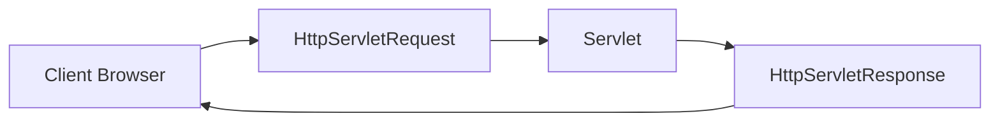

---

## 3. Understanding the Web (Request-Response Model)

The web operates using the HTTP protocol. When a user interacts with a website:
1. The browser sends an HTTP request.
2. The server receives it.
3. The corresponding Servlet processes it.
4. A response is sent back to the browser.

This entire cycle is managed by the **Servlet Container** (like Apache Tomcat).

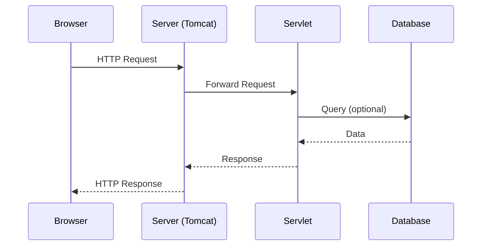

---

## 4. Installing Tools: Eclipse & Tomcat

### Eclipse IDE for Java EE  
Needed because it supports:
- Dynamic Web Projects  
- JSP editing  
- Automatic deployment  

### Apache Tomcat  
A web server + servlet container used to run your application.

### Steps to Configure in Eclipse:
1. Install Tomcat  
2. Open Eclipse → **Servers** tab  
3. Add new server → Select Tomcat  
4. Point to installation folder  

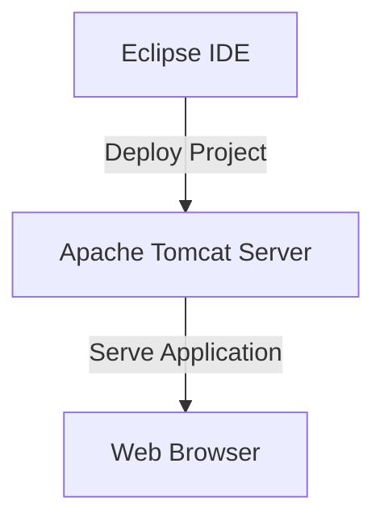

---

## 5. Creating a Dynamic Web Project

### Project Structure:
```
YourProject/
│
├── Java Resources/
│   └── src/ (Java files: Servlets)
│
├── WebContent/
│   ├── index.html / .jsp
│   ├── META-INF/
│   └── WEB-INF/
│       ├── web.xml
│       └── lib/ (JAR dependencies)
```

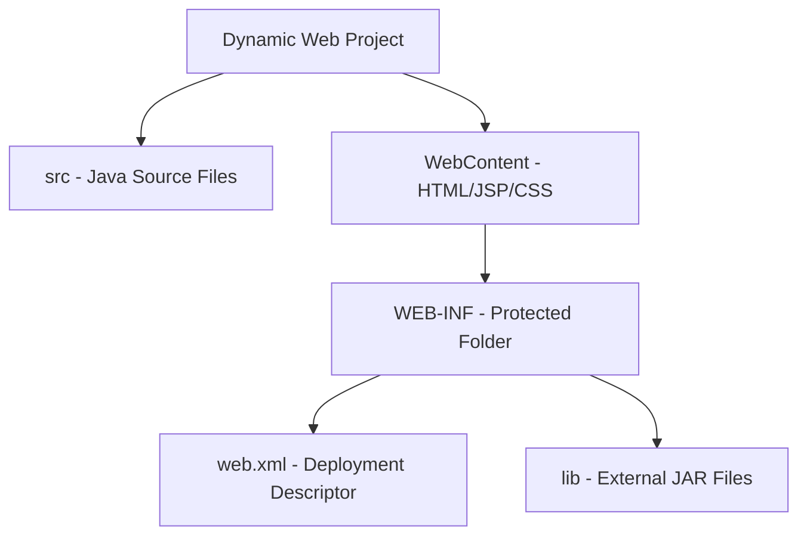

---

## 6. Writing Your First Servlet

### Example:
```java
@WebServlet("/hello")
public class HelloServlet extends HttpServlet {
    protected void doGet(HttpServletRequest req, HttpServletResponse resp) throws IOException {
        resp.getWriter().println("Hello from Servlet!");
    }
}
```

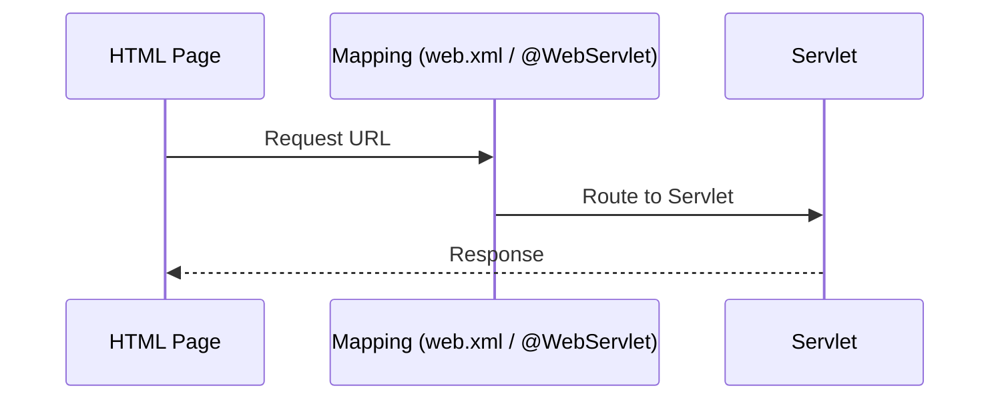

---

## 7. Servlet Lifecycle

Servlets do not recreate themselves for every request.

1. `init()` – runs once  
2. `service()` – runs per request  
3. `destroy()` – runs at shutdown  

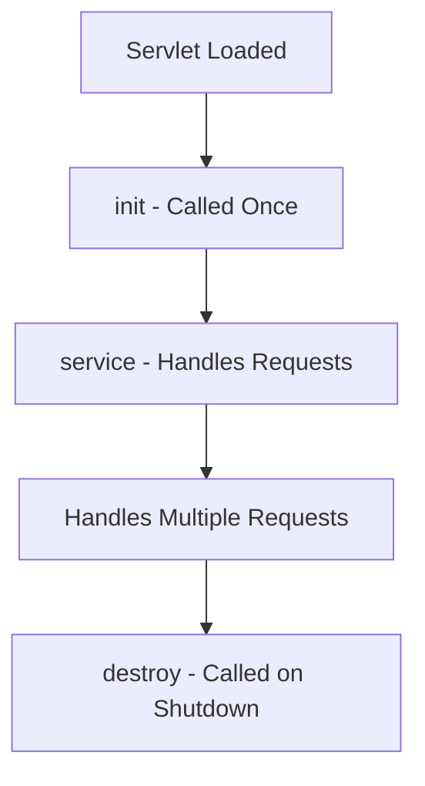

---

## 8. Handling GET and POST Requests

### GET:
- Appends parameters to URL  
- Visible  

### POST:
- Sends data in body  
- More secure  

```java
String name = request.getParameter("username");
```

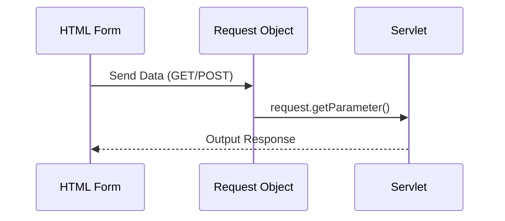

---

## 9. RequestDispatcher: Forward vs Redirect

### Redirect (`sendRedirect`)
- Creates new request  
- URL changes  

### Forward
- Internal server jump  
- No URL change  

#### Redirect:
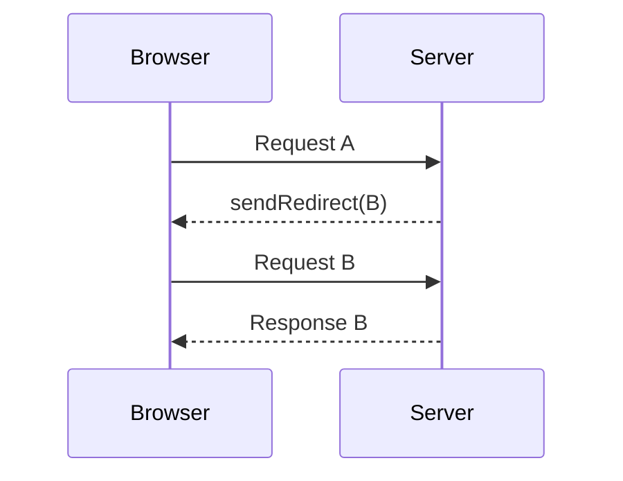

#### Forward:
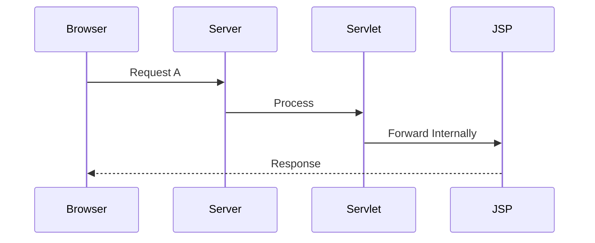

---

## 10. Cookies & Sessions

### Cookies:
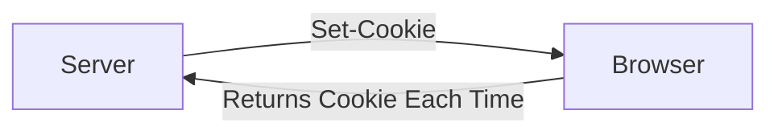

### Sessions:
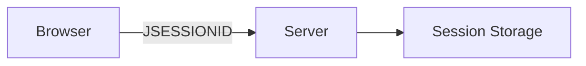

---

## 11. JSP – JavaServer Pages

JSP avoids print statements in servlets.

### Elements:
- Scriptlets  
- Expressions  
- Declarations  

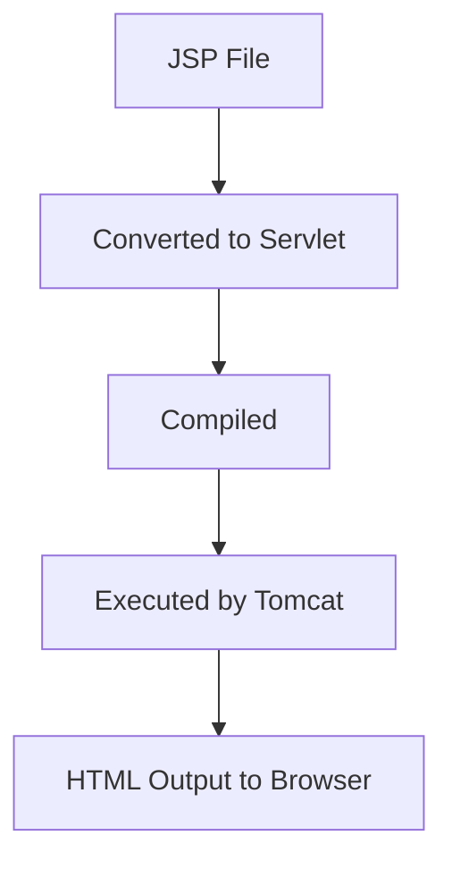

---

## 12. Expression Language (EL)
```jsp
${user}
```

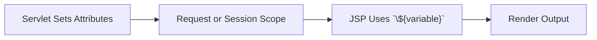


---

## 13. JSTL
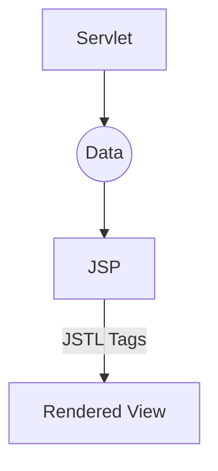

---

## 14. MVC Architecture

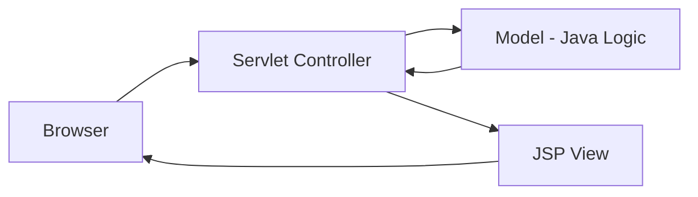

---

## 15. Filters

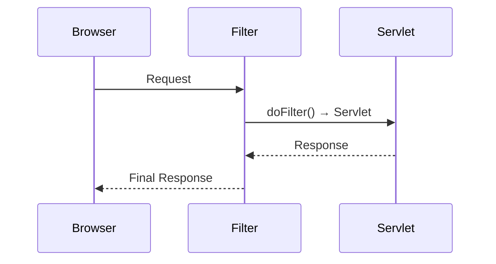

---

## 16. File Upload Handling

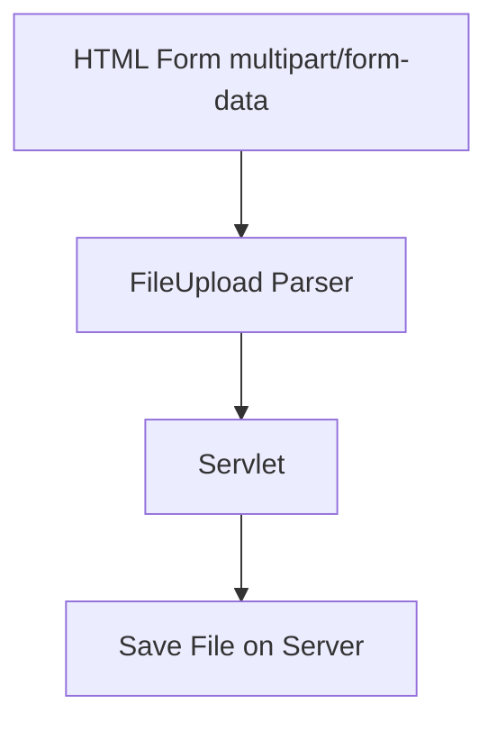

---

## 17. JDBC – Database Connectivity

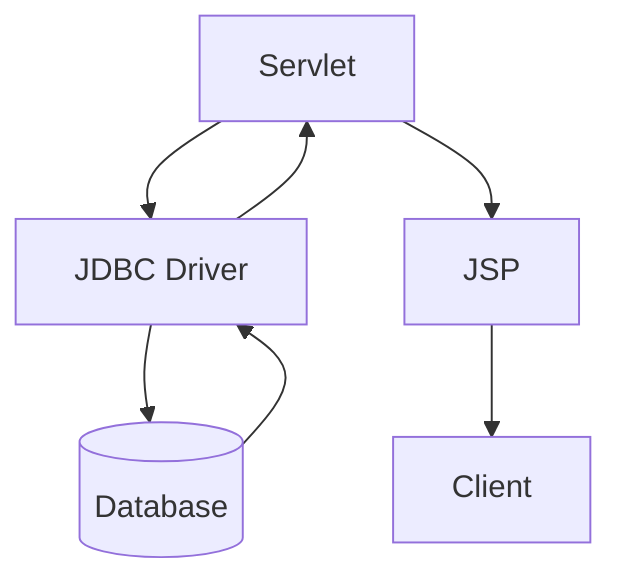

---

## 18. Deployment Using WAR

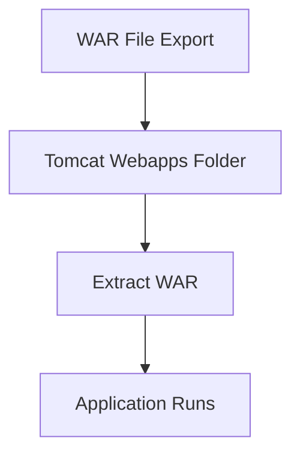

---
